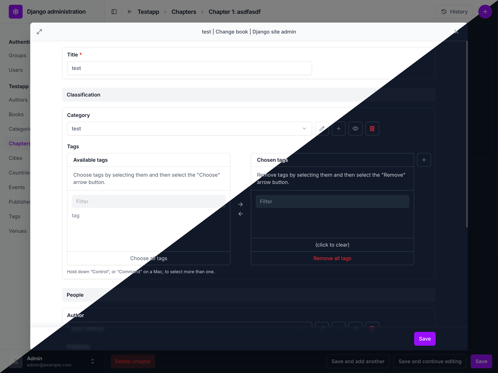

# django-unfold-modal
[](https://pypi.org/project/django-unfold-modal/) [](https://github.com/metaforx/django-unfold-modal/actions/workflows/ci.yml)

Modal-based related-object popups for [django-unfold](https://github.com/unfoldadmin/django-unfold).

Replaces Django admin's popup windows for related objects (ForeignKey, ManyToMany, etc.) with Unfold-styled modals.

## Features
- Modal replacement for admin related-object popups
- Supports nested modals (replace/restore behavior)
- Raw ID lookup + autocomplete + inline related fields
- Optional modal resize + size presets
- Optional admin header suppression inside iframe
- Django CMS modal support (open admin modals in Django CMS parent window)
- Django Filer widget support (folder and file selection)
- Stylable using Unfold theme configuration & custom CSS

## Motivation
As much as I love the Django admin, I’ve always found its related-object pop-ups clunky and outdated. 
They open in separate browser windows, which breaks the flow and doesn’t fit modern UI patterns. 
It’s fine for straightforward admin use, but when exposed to users, it often causes confusion.

[Django Unfold](https://github.com/unfoldadmin/django-unfold) greatly improves the admin’s UX for regular users.
This package modernizes related-object interactions while following Unfold’s design principles.

Since version 0.107, Unfold opens related objects in its own modal. If that is all you need, the native feature is the simpler choice.
unfold-modal remains a more versatile solution if you want your own modals in the admin, need Django Filer support, or want all modals to follow the same pattern.

## Requirements

- Python 3.10+
- Django 5.0+
- django-unfold `>=0.52.0,<0.109`

Tested combinations (from the locked test matrix): django-unfold 0.81.0 on Python 3.10,
0.91.0 on Python 3.11, 0.108.0 on Python 3.12. Newer Unfold versions require Python 3.12+
and Django 5.2+, because Unfold itself requires them.

## Installation

```bash
pip install django-unfold-modal
```

Add to your `INSTALLED_APPS` after `unfold`:

```python
INSTALLED_APPS = [
    "unfold",
    "unfold.contrib.filters",
    "unfold_modal",  # Add after unfold, before django.contrib.admin
    "django.contrib.admin",
    # ...
]
```

Add the required styles and scripts to your Unfold configuration in `settings.py`:

**Minimal setup:**

```python
from unfold_modal.utils import get_modal_styles, get_modal_scripts

UNFOLD = {
    # ... other unfold settings ...
    "STYLES": [
        *get_modal_styles(),
    ],
    "SCRIPTS": [
        *get_modal_scripts(),
    ],
}
```

This setup loads only the core modal scripts. If you do not use the configuration options below, this is enough.

**Config-enabled setup** (for custom sizes and resize handle):

```python
from unfold_modal.utils import get_modal_styles, get_modal_scripts_with_config

UNFOLD = {
    # ... other unfold settings ...
    "STYLES": [
        *get_modal_styles(),
    ],
    "SCRIPTS": [
        *get_modal_scripts_with_config(),
    ],
}
```

This setup adds a config script (served from `unfold_modal.urls`) before the core JS so the frontend can read size presets and `UNFOLD_MODAL_RESIZE`. See **Configuration** below for the options that require it.

## Configuration

The following settings are available (all optional):

```python
# Modal size preset: "default", "large", or "full" (default: "default")
UNFOLD_MODAL_SIZE = "default"

# Enable manual resize handle on modal (default: False)
UNFOLD_MODAL_RESIZE = False

# Hide admin header inside modal iframes (default: True)
UNFOLD_MODAL_DISABLE_HEADER = True

# Handle every related popup, including those Unfold 0.107+ can open natively (default: True)
UNFOLD_MODAL_OVERRIDE_NATIVE = True
```

### Size Presets

To use custom size presets (`UNFOLD_MODAL_SIZE`) or enable resize (`UNFOLD_MODAL_RESIZE`):

1. Include the app's URLs in your `urls.py`:

    ```python
    from django.urls import include, path

    urlpatterns = [
        path("admin/", admin.site.urls),
        path("unfold-modal/", include("unfold_modal.urls")),
    ]
    ```

2. Use `get_modal_scripts_with_config` instead of `get_modal_scripts` in your UNFOLD configuration (see Installation section above).

| Preset    | Width | Max Width | Height | Max Height |
|-----------|-------|-----------|--------|------------|
| `default` | 90%   | 900px     | 85vh   | 700px      |
| `large`   | 95%   | 1200px    | 90vh   | 900px      |
| `full`    | 98%   | none      | 95vh   | none       |

## Unfold's Native Related Modals

Unfold 0.107 added its own modal for related objects. unfold-modal still handles all
related popups by default (`UNFOLD_MODAL_OVERRIDE_NATIVE = True`), so existing projects
need no change.

Set it to `False` to let Unfold handle related popups on normal admin pages. unfold-modal
then only handles CMS-hosted admin, modal chains it started and Filer widgets. The setting
has no effect before Unfold 0.107.

## Django CMS Integration

When Django admin is embedded inside a Django CMS modal (e.g., editing a page plugin), unfold-modal can render its modals in the CMS parent document instead of inside the admin iframe.

### How It Works

- Admin inside a **CMS sideframe** iframe: modals open inside the iframe (standard behavior).
- Admin inside a **CMS modal** iframe (`.cms-modal`): modals open in the CMS parent document for a seamless full-page experience.

Detection is automatic based on the presence of a `.cms-modal` ancestor in the parent DOM.

### CMS Template Setup

Load the required assets in your CMS base template (e.g., a custom `base.html` extending CMS templates):

```html

<head>
    ...
    
</head>
```

This outputs the Material Symbols icon font, modal CSS, inline config, and JS modules needed for CMS parent-window modal hosting. The icon font is required so modal controls (close, maximize) display as glyphs instead of plain text. The modal uses a high z-index (`9999999`) to render above Django CMS layers.

### CMS Modal Settings

CMS modal settings are independent from regular admin modal settings. Defaults are optimized for CMS context (fullscreen):

```python
# CMS modal size preset (default: "full")
UNFOLD_CMS_MODAL_SIZE = "full"

# Enable resize handle in CMS modal (default: False)
UNFOLD_CMS_MODAL_RESIZE = False

# Hide admin header inside CMS modal iframes (default: True)
UNFOLD_CMS_MODAL_DISABLE_HEADER = True
```

Regular `UNFOLD_MODAL_*` settings continue to apply to standard admin modal usage. CMS settings only affect modals opened from within a CMS modal context.

## Supported Widgets

- ForeignKey select
- ManyToMany select
- OneToOne select
- `raw_id_fields` lookup
- `autocomplete_fields` (Select2)
- Related fields within inline forms
- View-related link (opens the related object in the modal)
- Django Filer folder and file selection widgets

File and folder picking through Filer's widgets is supported in the modal. Filer's own
edit, "New Folder" and cancel flows inside the modal need
[django-unfold-extra](https://github.com/metaforx/django-unfold-extra)'s Filer
integration.

## Testing

```bash
uv run pytest --ignore-glob='tests/test_ui_*.py' -q
uv run pytest tests/test_ui_*.py --browser chromium -q
```

See `tests/README.md` for the test app overview and Playwright scope.

## CI

GitHub Actions runs on all PRs and pushes to `main`/`development`:

- Unit tests across Python 3.10, 3.11, 3.12
- Playwright UI tests with Chromium

Configure branch protection to require the CI check to pass before merging.

## AI
Beyond the practical use of the package, the project was also driven by the incentive to explore AI-assisted research and development. All code was intentionally written by AI using structured, automated agent orchestration. This included development and review by different models, as well as result verification and regression testing during development and deployment.

The architecture and implementation was designed by me. No code entered the repository without an overview.

If interested in the process, see plans, tasks and reviews folder to get an idea of how the package was developed.


## License

MIT
